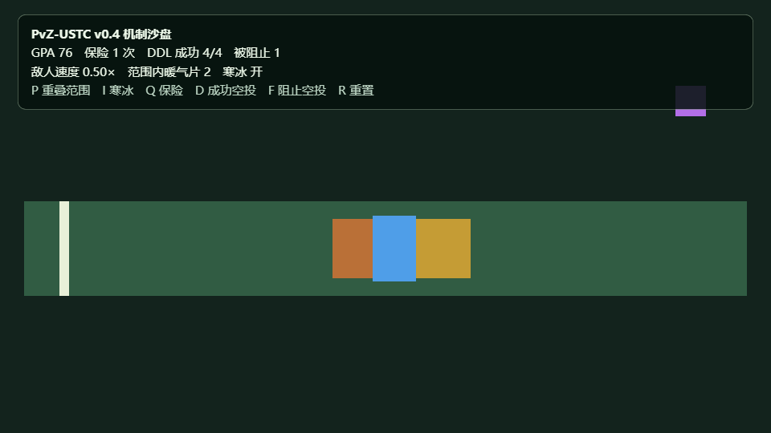

# v0.1 VibeGame 运行证据

## 环境

- 日期：2026-09-04
- VibeGame：`cab478bf2dafe93bd586aa1043a1e2182f4da197`
- VibeGame 包版本：`0.1.0`
- 系统：Windows，Python 3.12.8，uv 0.11.14，Chrome 前台运行时
- 测试：`tests/bot/mechanics_smoke.py`

## 结果

`vibegame run . --bot tests/bot/mechanics_smoke.py` 返回：

```json
{
  "ok": true,
  "status": "done",
  "reason": "all mechanism contracts passed",
  "duration_s": 1.0502,
  "decision_count": 11,
  "console_errors": []
}
```

`.vibegame/logs/` 中的原始录像、trace 和结果属于本地运行产物，不提交 Git。本文件保留已核对的关键状态。

| 检查点 | 暖气片数 | 寒冰 | 速度倍率 | GPA | 保险 | DDL 成功 | DDL 被阻止 | 结果 |
| --- | ---: | --- | ---: | ---: | ---: | ---: | ---: | --- |
| 初始 | 0 | 关 | 1.0 | 100 | 0 | 0 | 0 | 通过 |
| 两台暖气片重叠 | 2 | 关 | 0.8 | 100 | 0 | 0 | 0 | 不叠加，通过 |
| 重叠范围内开启寒冰 | 2 | 开 | 0.5 | 100 | 0 | 0 | 0 | 寒冰优先，通过 |
| 保险触发 | 2 | 开 | 0.5 | 92 | 1 | 0 | 0 | 扣 8，通过 |
| 四次成功空投 | 2 | 开 | 0.5 | 76 | 1 | 4 | 0 | 每次扣 4，通过 |
| 第五次成功空投 | 2 | 开 | 0.5 | 76 | 1 | 4 | 0 | 达到上限后不扣，通过 |
| 被阻止空投 | 2 | 开 | 0.5 | 76 | 1 | 4 | 1 | 不扣分，通过 |
| 寒冰结束 | 2 | 关 | 0.8 | 76 | 1 | 4 | 1 | 回到暖气片倍率，通过 |

## 视觉证据



## 尚未覆盖

- 用逐帧位移而不是运行状态字段独立反算 `1.0/0.8/0.5` 三档倍率。
- 敌人从范围外自然进入、离开范围，以及多条泳道的范围判定。
- 暂停、恢复、关卡重开和关卡退出后的状态清理。
- DDL 从出现、抓取、被击败、被弹开到真正离屏的完整事件链。
- 原版 PvZ 内的对象字段、调用时机和实机回归。
