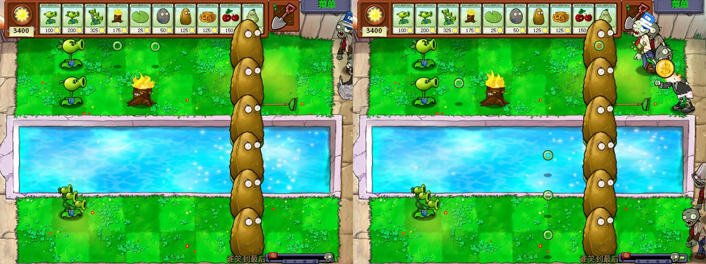
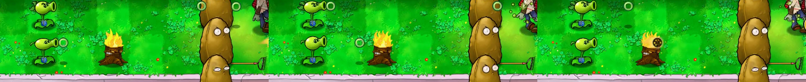

# v0.5 绿色圆圈家族复用与火化实机观察

测试日期：2026-08-31

状态：双发科豆、三线科豆复用绿色圆圈通过；P01 弹丸经过暖气片后切换为原版火化弹丸通过。其他射手、寒冰弹丸和跨场景仍待测。

## 测试对象

| 对象 | SHA-256 / 结果 |
| --- | --- |
| 原版 `PlantsVsZombies.exe` | `6F1729369AC9C5F859E8F3B55FE7D513FBC20B5C54127FD3A1C7E500237FDE6F` |
| 原版 `main.pak` | `3B5291C6600076AAF1791AE1FB2DBF247290A23E903D1D376413DA17358E049D` |
| 十六替换累计 PAK | `9DB70BB44031EF6B12ED92FF9F79BC9737B382D2F0D0383607DA1AAABAADB90B` |
| 累计清单 | `patches/manifests/v0.5-p01-green-circle-p02-p04-z01-sleeves-z03-ingame.json`，2413 个资源中替换 16 项 |
| 场景 | 迷你游戏“谁笑到最后”，白天泳池 |

测试使用原版 EXE，只临时换入十六替换累计 PAK。选卡后先布阵，再开始波次；录像期间没有暂停或干预弹丸。

## 布阵

| 路线 | 布置 | 用途 |
| --- | --- | --- |
| 第一行 | 双发科豆，不放暖气片 | 观察同一行的连续绿色圆圈 |
| 第二行 | P01 绿圈科豆，前方放一株暖气片 | 观察转换前后的两种弹丸资源 |
| 第五行 | 三线科豆，不放暖气片 | 同时观察第四、第五、第六行的绿色圆圈 |
| 第七列 | 六行高坚果，泳池行先垫荷叶 | 延长弹丸飞行距离，提供统一的观察背景 |

初始 5000 专注值足够完成布阵。开始波次后不再购买植物，也没有改写进程内状态。

## 家族复用

| 检查项 | 结果 |
| --- | --- |
| 双发科豆 | 第一行多次同时出现前后两个绿色圆圈，透明中心、深绿内沿和原版阴影均与 P01 弹丸一致 |
| 三线科豆 | 第四、第五、第六行同时出现绿色圆圈；泳池水面和草坪上的透明中心都能辨认 |
| 飞行路径 | 两个槽位沿各自原弹道向右移动，没有回退成实心豌豆，也没有出现黑底或方形边界 |
| 资源范围 | 录像证明双发和三线实际读取了同一绿色弹丸资源；不据此声称所有普通射手都已逐株观察 |

左图的第一行有两个前后分开的圆圈，发射者是双发科豆。右图下半部能看到三线科豆和三条路线中的圆圈，其中一条经过泳池背景。

## 暖气片火化

连续三帧取自 31.9、32.1 和 32.3 秒：

1. 绿色圆圈从第二行 P01 喷口离开。
2. 圆圈到达暖气片左侧，仍保留透明中心。
3. 暖气片右侧出现原版棕橙色火化弹丸，绿色圆圈没有穿过后继续残留。

`FirePea.png`、火焰拖尾、命中粒子和音效都没有被累计包替换。本轮只确认资源切换和火化弹丸飞行，没有测量伤害倍率，也没有把暖气片的原版贴图算作 USTC 美术完成。

## 证据哈希

| 文件 | SHA-256 | 保存位置 |
| --- | --- | --- |
| `p01-family-reuse-last-stand-v01.png` | `08A972F40E80A2198F12B5D71F88189B084B326B92AFFB602C0998D543B8055A` | Git |
| `p01-torch-conversion-v01.png` | `6FF77C744FAFC6FDDA989C31F586B8972D4BCD9916A9BE24E070CE1BF7B4259D` | Git |
| `last-stand-family-fire-45s.mp4` | `3CEF0D19BFC19156D4A84F674C14B2724E3E9FB753C32FD9F3F2D86AD49B2109` | 本地 `.work`，Git 忽略 |

原始录像为 800×600、45 秒、1349 帧。波次开始前的布阵和波次中的自然战斗都在同一个文件里，仓库只保存两张复核图。

## 自动核验

- Python 全量测试通过，共 77 项。
- 16 份契约注册表通过，覆盖 5 个槽位和 16 个唯一 PAK 目标。
- 十六替换累计清单预演通过，输出哈希与测试包一致。
- PAK 零替换往返、LawnStrings 检查与同步检查、v0.3 常量补丁预演通过。

## 运行状态恢复

测试前另建快照，结束后恢复 PAK、五个存档文件和注册表。

| 恢复项 | 恢复后 SHA-256 / 数值 |
| --- | --- |
| `main.pak` | `3B5291C6600076AAF1791AE1FB2DBF247290A23E903D1D376413DA17358E049D` |
| `game1_0.dat` | `2AAE128C5A2E588B200BBEDF0EBBA628495B75F9A96EEDD3B9ED2679257A2416` |
| `log.txt` | `E94BB5CBD29F9E1F358E4569081BF72D638E0E6ADB32CA3E7BA3456ED772F515` |
| `stat1.txt` | `77B16A31EA014056B47193D4939458BF93120737F26B3098584C9810A2143169` |
| `user1.dat` | `7D8CA79F0EFA2B168A8DCEEF89E0FB3C61A64C6B062AEB5F43CB2611B55091F6` |
| `users.dat` | `7812F2BAF43689ED0DC9D077ECEAFA220EF3AF54EF33CE9CAEA1DD3C75BD9651` |
| 窗口设置 | `ScreenMode=0`，`PreferredX=1746`，`PreferredY=451` |
| 游戏进程 | 0 个 |

六个文件都与本轮测试前快照逐字节一致。测试用 PAK、存档变化和游戏进程均未留在工作环境中。

## 尚未覆盖

- 分裂射手、机枪射手等其他普通绿色弹丸使用者的逐株观察。
- 寒冰弹丸是否保持原资源，以及寒冰弹丸经过暖气片后的转换。
- 火化弹丸命中、溅射和伤害倍率。
- 夜间、雾夜和屋顶背景下的绿色圆圈与火化弹丸对比度。
- P01 眨眼帧和完整迷你游戏流程。本轮阵型最终失败，不把弹丸验证写成关卡通关。
