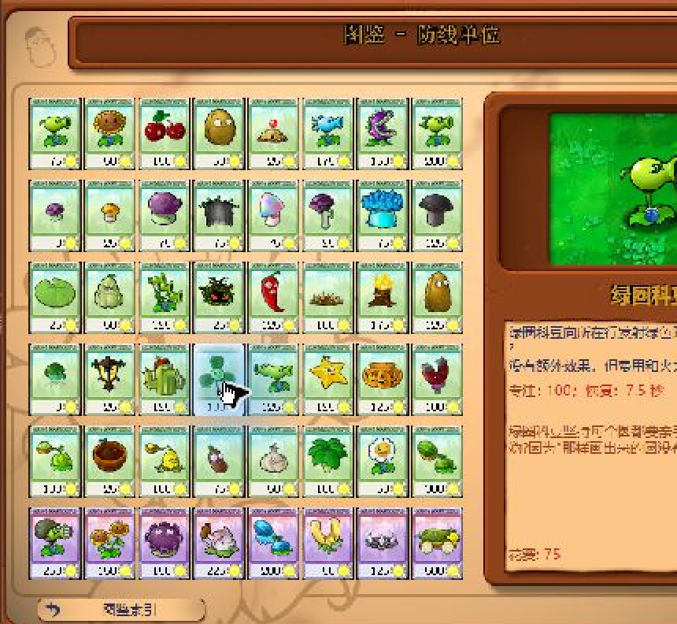

# v0.5 P01 白天垂直切片

测试日期：2026-08-30

## 测试组合

| 项目 | SHA-256 |
| --- | --- |
| 基线 EXE | `6F1729369AC9C5F859E8F3B55FE7D513FBC20B5C54127FD3A1C7E500237FDE6F` |
| v0.3 临时补丁 EXE | `CB0E0FFF4A530164582E3E0A86FA046A5217AC4293F961A75FB3097C853899B8` |
| 基线 PAK | `3B5291C6600076AAF1791AE1FB2DBF247290A23E903D1D376413DA17358E049D` |
| P01 双替换 PAK | `137121F3317FD710BEE0A918A73C1A8A3666E9363C920CA64E08D8276DBB96EB` |

先用基线 EXE 加 P01 双替换 PAK 检查纯资源改动，再用 v0.3 补丁 EXE 加同一 PAK 检查费用。运行前备份 `userdata` 和 `HKCU\Software\PopCap\PlantsVsZombies`，结束后逐项恢复。

## 已观察

| 检查项 | 结果 |
| --- | --- |
| 主菜单与选卡载入 | 通过，没有 PAK 解析错误或缺图 |
| P01 白天待机 | 原头部、喷口、茎叶和落点保持不变；黑色圆框与中央蓝书可辨 |
| P01 发射 | 弹丸正常离开喷口，头部与前叶没有瞬移、翻转或遮挡 |
| 战斗卡槽 | P01 小图能看到蓝书；v0.3 费用显示 75 |
| 植物图鉴 | 同一套 reanim 正常缩放，眼镜和蓝书可见，底部明确显示“花费：75” |
| 基线费用对照 | 同一存档与 PAK 下，基线 EXE 仍显示 100 |
| 运行状态恢复 | 游戏进程已退出；EXE、PAK、`user1.dat` 和窗口位置均恢复 |

发射帧中，豌豆已经离开喷口，蓝书仍跟随前叶：


图鉴同时给出角色缩放效果与 75 费用。截图只做裁切和最近邻放大，以移除无关悬浮层，没有重绘游戏内容：



截图哈希：

```text
p01-firing-v03.png   E6DC74C1CA6866348FC580D568347653AA7F859F932180D71BAB7E32E3D16F72
p01-almanac-v03.png  84BF15C21EAF9859CB702226AA035AF02A737B4420D7D06981CFE7A8AD6AFFCD
```

## 恢复证据

| 项目 | 恢复结果 |
| --- | --- |
| `PlantsVsZombies.exe` | `6F1729369AC9C5F859E8F3B55FE7D513FBC20B5C54127FD3A1C7E500237FDE6F` |
| `main.pak` | `3B5291C6600076AAF1791AE1FB2DBF247290A23E903D1D376413DA17358E049D` |
| `user1.dat` | `7D8CA79F0EFA2B168A8DCEEF89E0FB3C61A64C6B062AEB5F43CB2611B55091F6` |
| 窗口位置 | `PreferredX=1746`，`PreferredY=451`，`ScreenMode=0` |

自动启动接口只创建了没有窗口的进程；从仓库目录正常启动同一 EXE 后窗口才出现。因此运行脚本后续必须以“出现可控制窗口并进入菜单”为启动成功条件，不能只检查进程存在。

## 尚未证明

- 这轮没有单独冻结并保存眨眼帧。
- 只检查了白天 1-4，没有完成夜间、水池、雾夜、屋顶和小游戏抽查。
- 没有完整通关本关，因此不把 v0.2 或 v0.3 标为完成。
- P04 的 4200 耐久仍需实战或内存观察。
