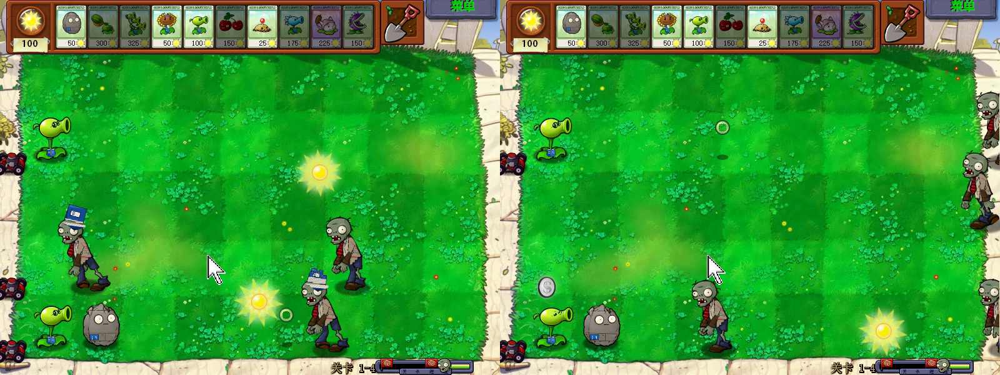
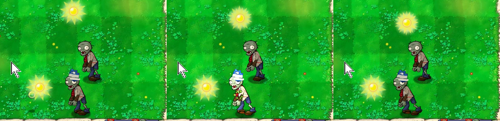

# v0.5 绿色圆圈与共享骨架实机观察

测试日期：2026-08-31

状态：白天冒险关中的绿色圆圈飞行与命中通过；Z01 行走和 Z03 受击时的卷面躯干、袖片层级通过。双发、三线复用与暖气片火化后来也已补测；Z01 啃食、头部脱落和十六项包中的 Z03 四阶段也已补测。断臂替代袖片、死亡收尾和跨场景仍待测。

## 测试对象

| 对象 | SHA-256 / 结果 |
| --- | --- |
| 原版 `PlantsVsZombies.exe` | `6F1729369AC9C5F859E8F3B55FE7D513FBC20B5C54127FD3A1C7E500237FDE6F` |
| 原版 `main.pak` | `3B5291C6600076AAF1791AE1FB2DBF247290A23E903D1D376413DA17358E049D` |
| 十六替换累计 PAK | `9DB70BB44031EF6B12ED92FF9F79BC9737B382D2F0D0383607DA1AAABAADB90B` |
| 累计清单 | `patches/manifests/v0.5-p01-green-circle-p02-p04-z01-sleeves-z03-ingame.json`，2413 个资源中替换 16 项 |
| 场景 | 冒险模式 1-4，白天草坪 |

本轮使用原版 EXE，只临时换入十六替换累计 PAK。录像来自已有存档的自然战斗，没有暂停游戏或逐帧干预敌人状态。

## 绿色圆圈

| 检查项 | 结果 |
| --- | --- |
| 飞行 | 两株 P01 持续发射，圆圈沿原弹道向右移动；多个位置都能看清透明中心和深绿内沿 |
| 战场缩放 | 28×28 原尺寸资源缩到战场比例后仍像圆圈，没有重新读成实心豌豆 |
| 阴影 | 未修改的原版弹丸阴影仍独立落在弹丸下方，没有填住中心孔 |
| 命中 | 7.8 秒画面中圆圈接近受损 Z03，8.1 秒目标闪白并出现原版红色受击粒子，8.3 秒圆圈消失 |
| 透明与锚点 | 飞行和命中前没有黑底、方形边界或明显跳位 |

这段录像能证明弹丸进入了原版飞行和命中流程，但没有读取敌人耐久，因此不把画面写成伤害数值测试。

左图同时出现完整与受损书套、卷面袖片和飞行中的绿色圆圈；右图把圆圈放在较干净的草坪背景上，透明中心更容易辨认。

三帧依次是接近目标、受击闪白和命中后消失。中间帧保留原版命中反馈，没有给截图另加标记。

## Z01 与 Z03 共享层级

| 检查项 | 结果 |
| --- | --- |
| 无装备 Z01 行走 | 旧卷面躯干与行走轨道调用的袖片随手臂摆动，纸色上臂没有脱离肩部或盖住手掌 |
| 完整书套 Z03 | 蓝色书套留在头顶，下面的卷面躯干和袖片仍能正常显示 |
| 受损书套 Z03 | 露页明显的受损书套与共享袖片同时出现，装备层没有把上臂压到错误前后关系 |
| Z03 受击 | 闪白和粒子出现时袖片、躯干与书套仍在同一动画位置，没有整张贴图飞走 |
| 画面完整性 | 30 秒录像和命中段抽帧中未见黑块、透明底错误或固定在屏幕上的部件 |

本轮只关闭“白天行走”和“装备受击时的共享层级”两项。后续泳池测试已经在十六替换包中重新触发书套完整、轻伤、重伤和脱落，并补到 Z01 啃食与头部脱落动作，见 [`v0.5-z01-z03-actions-runtime.md`](v0.5-z01-z03-actions-runtime.md)。

## 证据哈希

| 文件 | SHA-256 | 保存位置 |
| --- | --- | --- |
| `p01-z01-z03-adventure-v01.png` | `1F23300CB58274F4C2E91F33F3B554AC20AEC3359718DA90434371C77101C3C2` | Git |
| `p01-green-circle-impact-v01.png` | `D17C08BE0AFEE5E8D4321BDE2B0FAD20723686F7867546B3DC6E90B5A8B6641E` | Git |
| `adventure-1-4-natural-30s.mp4` | `BEE13CA1533545B5F590BA73EFD8141518DC983AB64CEF35C9863933BB2E4DB4` | 本地 `.work`，Git 忽略 |

原始录像为 800×600、30 秒、899 帧。仓库只保存两张复核图，不提交录像和未裁切抽帧。

## 自动核验

- Python 全量测试通过，共 77 项。
- 十六替换累计清单预演通过，确认 2413 个资源中只替换 16 项。
- 16 份契约、候选哈希、PAK 重建哈希和零替换往返检查均通过。

## 运行状态恢复

测试前备份了 PAK、五个存档文件和注册表。观察结束后逐项恢复并重新计算哈希。

| 恢复项 | 恢复后 SHA-256 / 数值 |
| --- | --- |
| `main.pak` | `3B5291C6600076AAF1791AE1FB2DBF247290A23E903D1D376413DA17358E049D` |
| `game1_0.dat` | `2AAE128C5A2E588B200BBEDF0EBBA628495B75F9A96EEDD3B9ED2679257A2416` |
| `log.txt` | `E94BB5CBD29F9E1F358E4569081BF72D638E0E6ADB32CA3E7BA3456ED772F515` |
| `stat1.txt` | `77B16A31EA014056B47193D4939458BF93120737F26B3098584C9810A2143169` |
| `user1.dat` | `7D8CA79F0EFA2B168A8DCEEF89E0FB3C61A64C6B062AEB5F43CB2611B55091F6` |
| `users.dat` | `7812F2BAF43689ED0DC9D077ECEAFA220EF3AF54EF33CE9CAEA1DD3C75BD9651` |
| 窗口设置 | `ScreenMode=0`，`PreferredX=1746`，`PreferredY=451` |
| 游戏进程 | 0 个 |

六个文件都与测试前快照逐字节一致，测试用累计 PAK 没有留在仓库根目录。

后续泳池切片已经补上双发、三线和暖气片火化，见 [`v0.5-p01-family-fire-runtime.md`](v0.5-p01-family-fire-runtime.md)；Z01 动作和 Z03 四阶段回归见 [`v0.5-z01-z03-actions-runtime.md`](v0.5-z01-z03-actions-runtime.md)。分裂射手、机枪射手等其他普通弹丸使用者仍未逐株观察。

## 尚未覆盖

- 寒冰弹丸是否完全不受共享资源改动影响。
- P01 眨眼，以及夜间、水池、雾夜和屋顶的弹丸对比度。
- Z01 单体断臂替代袖片、无头躯干倒地和消失收尾。
- 完整关卡流程和精确伤害数值。
