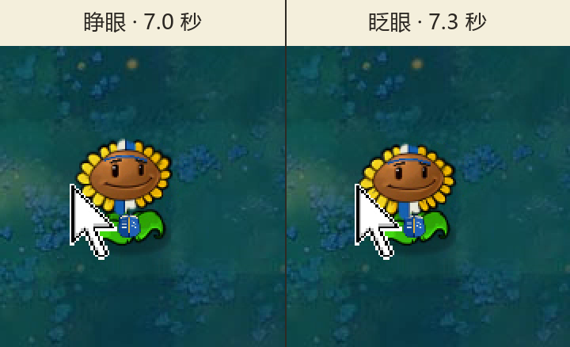

# v0.5 P02 夜间眨眼切片

测试日期：2026-08-30

状态：P02 夜间眨眼通过；完整一波和水池、雾夜、屋顶仍待检查。

## 测试对象

| 项目 | SHA-256 |
| --- | --- |
| 基线 EXE | `6F1729369AC9C5F859E8F3B55FE7D513FBC20B5C54127FD3A1C7E500237FDE6F` |
| 基线 PAK | `3B5291C6600076AAF1791AE1FB2DBF247290A23E903D1D376413DA17358E049D` |
| P01+P02+P04+Z03 累计测试 PAK | `B575640C88DFE52EC9919B4B55803D7C6EA717086C14E98A922C500A67ED613A` |

场景为“生存模式·黑夜”。测试包保持原版 `SunFlower.reanim.compiled` 不变，只替换 P02 的基础头部、顶部成组花瓣和底部成组花瓣；眨眼仍由原动画中的 `BLINK1`、`BLINK2` 覆盖层完成。

## 已观察

同一段 800×600 游戏窗口录像中，P02 在 7.0 秒保持睁眼，在 7.3 秒进入闭眼帧。两帧间隔 0.3 秒，单位位置和背景没有切换，可以排除把普通待机帧误当成眨眼的情况。

| 检查项 | 结果 |
| --- | --- |
| 闭眼覆盖 | 上下眼睑按原动画闭合，没有黑块或残留睁眼瞳孔 |
| 学习头带 | 始终位于眼睛上方，没有被眨眼层遮住、截断或移到脸后 |
| 蓝白花瓣 | 两帧中层级和锚点连续，没有因头部眨眼发生跳位 |
| 夜间可读性 | 暖黄花盘、蓝色头带和蓝白便签花瓣都能从暗色草坪中辨认 |



证据图只把原录像中的两个完整游戏帧并排排版并加上时间标签，没有重绘角色内容：

```text
p02-night-blink-v01.png  B6ACF6E0FF63A87F0E2A342B9B34BC66BC3A6D502B444208806A3DE61A4FB938
```

## 测试边界

- 这段证据只能证明 P02 在夜间的一个眨眼周期和暗场可读性。
- 录像没有覆盖完整一波，因此不证明生产节奏、被吃流程或本关可以完整打完。
- 本轮没有捕捉到 P01 的眨眼帧，也没有完成水池、雾夜、屋顶和小游戏抽查。
- 累计包中的 P04 与 Z03 没有在这段录像中逐项验收；它们沿用各自已有记录。

## 恢复结果

游戏停在失败页数分钟没有继续变化后，只关闭了路径已经核对的测试进程。随后恢复测试前快照并逐项复验：

| 项目 | 恢复结果 |
| --- | --- |
| `main.pak` | `3B5291C6600076AAF1791AE1FB2DBF247290A23E903D1D376413DA17358E049D` |
| `game1_0.dat` | `2AAE128C5A2E588B200BBEDF0EBBA628495B75F9A96EEDD3B9ED2679257A2416` |
| `log.txt` | `E94BB5CBD29F9E1F358E4569081BF72D638E0E6ADB32CA3E7BA3456ED772F515` |
| `stat1.txt` | `77B16A31EA014056B47193D4939458BF93120737F26B3098584C9810A2143169` |
| `user1.dat` | `7D8CA79F0EFA2B168A8DCEEF89E0FB3C61A64C6B062AEB5F43CB2611B55091F6` |
| `users.dat` | `7812F2BAF43689ED0DC9D077ECEAFA220EF3AF54EF33CE9CAEA1DD3C75BD9651` |
| 注册表窗口设置 | `ScreenMode=0`，`PreferredX=1746`，`PreferredY=451` |
| 游戏进程 | 0 个 |

测试备份继续留在被 Git 忽略的 `.work` 中，没有删除；如需追查这轮录像，仍可回到测试前状态做对照。
