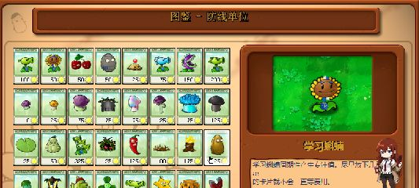
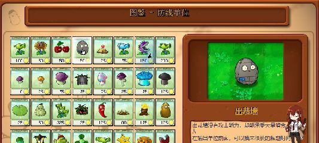
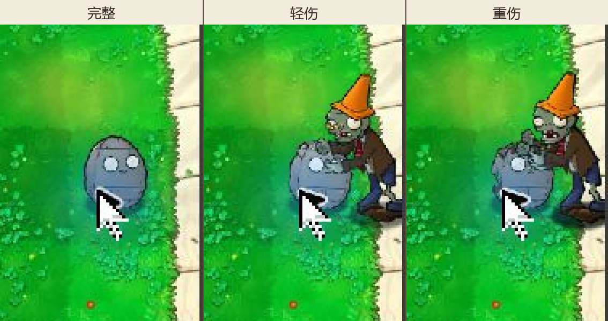

# v0.5 P02/P04 累计包实机观察

测试日期：2026-08-30

状态：白天垂直切片通过；眨眼、P04 设计耐久 4200 和跨场景待测。

## 测试对象

- 基线 EXE：`6F1729369AC9C5F859E8F3B55FE7D513FBC20B5C54127FD3A1C7E500237FDE6F`
- 基线 PAK：`3B5291C6600076AAF1791AE1FB2DBF247290A23E903D1D376413DA17358E049D`
- 累计测试 PAK：`ECDBA376D631EA59F738E35AA5F78C36722AA20A5EEC0339900A4433ED0CB12B`
- 场景：生存模式·白天、植物图鉴
- 累计替换：P01 两项、P02 三项、P04 三项，共 8 / 2413 个资源

本次只临时替换 `main.pak`，EXE 保持原版。因此 P04 能验证三档资源切换，但不能证明设计值 4200 已生效。

## P02 学习蝌蝻

| 检查项 | 结果 |
| --- | --- |
| 选卡缩略图 | 学习头带、暖黄主体和蓝白成组花瓣均可辨 |
| 落地待机 | 头部与花瓣随原动画摆动，没有跳位或黑底 |
| 产出瞬间 | 发光与专注值生成正常，蓝白花瓣仍保持原层级 |
| 图鉴放大 | 角色居中，头带和上下便签花瓣清楚；名称、费用 50 正常 |
| 被吃流程 | 沿用原版普通植物消失流程，没有残留不透明方块 |

尚未单独捕捉眨眼覆盖帧，也没有完成一整波或跨场景观察。现有结果足以保留“只改基础头部和两组花瓣”的首轮范围，暂不扩改其余 17 张独立花瓣。

## P04 出恭墙

| 检查项 | 结果 |
| --- | --- |
| 选卡缩略图 | 灰褐轮廓与蓝色编号牌可辨 |
| 图鉴放大 | 砖缝、眼睛和蓝色“14”编号牌位置正常；名称、费用 50 正常 |
| 完整阶段 | 原椭圆锚点稳定，编号牌位于左下 |
| 轻伤阶段 | 顶部缺口与裂纹按原槽位出现，墙面纹理没有跳位 |
| 重伤阶段 | 缺口继续扩大，脸部线稿和主体锚点仍保持原位置 |
| 阶段顺序 | 锥桶僵尸持续啃食时依次出现完整、轻伤、重伤，随后按原流程消失 |

这次使用原版 EXE，只证明原耐久基线能够驱动三张贴图。下一次应换入 v0.3 开发副本，确认 4200 耐久与两档阈值仍按预期工作，并补看眨眼、抽动、死亡前后和其他四种场景。

## 证据哈希

| 文件 | SHA-256 |
| --- | --- |
| `p02-production-v01.png` | `C8F100A39DF1EB35AD9E2A96DED458FEF034422A536C170C0827181A9508BB25` |
| `p02-almanac-v01.png` | `B6F41D70761DDDEE49BDC732E1D0FFFA4266587451207F6E188BCC4F2C515DD6` |
| `p04-almanac-v01.png` | `F72D74768CA9E06E40F07AD78542A6C82AD01E08E95A7EAA087847831EF56C03` |
| `p04-damage-stages-v01.png` | `D5A42E2F4E0000F4C20302E71F902AA3AF7EBBADAA68414AA423B1F8502B2FA4` |

## 恢复结果

测试进程只关闭本次启动的 `PlantsVsZombies.exe`。随后恢复了基线 PAK、五个存档文件和注册表窗口设置：

- EXE 恢复后 SHA-256：`6F1729369AC9C5F859E8F3B55FE7D513FBC20B5C54127FD3A1C7E500237FDE6F`
- PAK 恢复后 SHA-256：`3B5291C6600076AAF1791AE1FB2DBF247290A23E903D1D376413DA17358E049D`
- `game1_0.dat`、`log.txt`、`stat1.txt`、`user1.dat`、`users.dat`：全部与测试前备份逐字节一致
- 注册表：`ScreenMode=0`、`PreferredX=1746`、`PreferredY=451`
- 恢复后没有残留游戏进程，Git 工作树只包含本测试记录与证据图

因此本记录只把 P02/P04 的白天垂直切片记为通过，不代替完整关卡和五场景回归。
