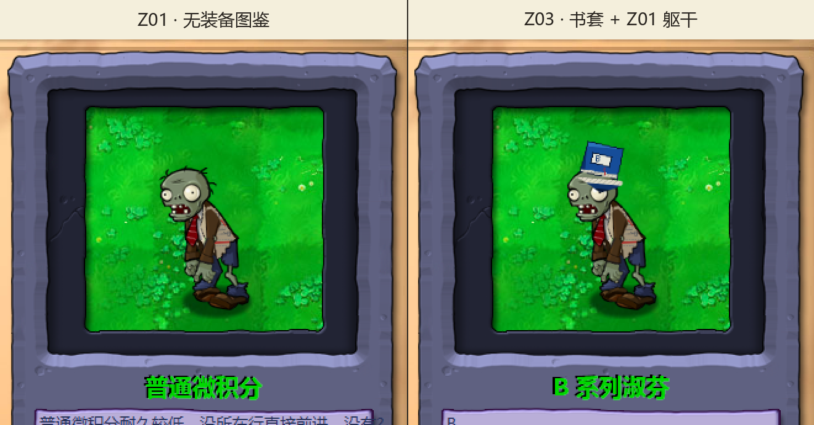

# v0.5 Z01 图鉴层级实机观察

测试日期：2026-08-31

状态：Z01 无装备图鉴与 Z03 书套组合通过；后续 16 项包已补到战场行走、啃食、头部脱落和书套四阶段。单体断臂、死亡收尾与跨场景待测。

## 测试组合

| 项目 | SHA-256 |
| --- | --- |
| 基线 EXE | `6F1729369AC9C5F859E8F3B55FE7D513FBC20B5C54127FD3A1C7E500237FDE6F` |
| 基线 PAK | `3B5291C6600076AAF1791AE1FB2DBF247290A23E903D1D376413DA17358E049D` |
| 12 项累计测试 PAK | `B89F7ACAB46F94EAD882D4AF81F08F6746FB08A3F9AA34E3F38D5DC11B4C76DD` |

累计包替换 P01 两项、P02 三项、P04 三项、Z01 一项和 Z03 三项，共 12 / 2413 个资源。EXE 与 `Zombie.reanim.compiled` 保持原版，本轮只观察共享 reanim 如何绘制新的 `Zombie_body.png`。

## 已观察

| 检查项 | 结果 |
| --- | --- |
| Z01 无装备图鉴 | 旧纸米黄、灰色演算线和红色批改线能在图鉴缩放下辨认；头、下颌、衬衫、领带与四肢仍按原层级绘制 |
| Z01 画布与锚点 | 没有黑底、整图偏移、身体漂浮或透明边界闪烁 |
| Z03 书套组合 | 深蓝书套与白色“B”题签正常位于头顶；同一张 Z01 卷面躯干在书套下出现，没有穿过头、手臂或领带 |
| 图鉴切换 | 从 Z01 切到 Z03 后角色位置和缩放保持一致，说明新增共享躯干没有改变 reanim 锚点 |



证据图从两张原生 800×600 游戏窗口截图中裁出同一图鉴预览区域，使用最近邻放大并加上面板标签，没有重绘角色内容：

```text
z01-z03-almanac-v01.png  117BDAB3919B129B3D5DA879BAF5E3B8276DC5E037D261849FA77F67E082D674
```

## 对当前美术范围的判断

这轮证明 `Zombie_body.png` 能安全接入共享骨架，但也确认它只是外套后片。前臂上方的 `Zombie_innerarm_upper.png`、`Zombie_outerarm_upper.png` 与断臂变体 `Zombie_outerarm_upper2.png` 仍保留原棕色，因此战斗尺寸下的“旧卷面”识别度比十倍静态预览弱。

图鉴里的差异来自首轮只改共享躯干后片，锚点和构建本身没有出错。后续三张棕色袖片已经作为独立差分阶段完成静态构建，见 [`v0.5-z01-sleeves-static.md`](v0.5-z01-sleeves-static.md)；行走、啃食、头部脱落和书套四阶段后来已在 16 项包中另行复查，见 [`v0.5-p01-z01-z03-runtime.md`](v0.5-p01-z01-z03-runtime.md)与 [`v0.5-z01-z03-actions-runtime.md`](v0.5-z01-z03-actions-runtime.md)。

## 尚未证明

- 本轮没有完成“谁笑到最后”的布阵，因此没有战场行走与啃食证据。
- 没有触发 Z03 完整、轻伤、重伤和书套脱落后的 Z01 躯干组合。
- 没有观察断臂、掉头、倒地死亡、水池游泳、夜间、雾夜或屋顶。
- 选卡过程中检测到用户前台输入后，自动操作立即停止；没有继续抢占窗口，也没有把未观察项目记为通过。

## 恢复结果

测试前备份保存在 `.work/runtime-save-backup-z01-20260831-01`。停止路径已经核对的测试进程后，恢复原版 PAK、五个用户数据文件与注册表，并逐项比较测试前后哈希：

| 项目 | 恢复结果 |
| --- | --- |
| `main.pak` | `3B5291C6600076AAF1791AE1FB2DBF247290A23E903D1D376413DA17358E049D` |
| `game1_0.dat` | `2AAE128C5A2E588B200BBEDF0EBBA628495B75F9A96EEDD3B9ED2679257A2416` |
| `log.txt` | `E94BB5CBD29F9E1F358E4569081BF72D638E0E6ADB32CA3E7BA3456ED772F515` |
| `stat1.txt` | `77B16A31EA014056B47193D4939458BF93120737F26B3098584C9810A2143169` |
| `user1.dat` | `7D8CA79F0EFA2B168A8DCEEF89E0FB3C61A64C6B062AEB5F43CB2611B55091F6` |
| `users.dat` | `7812F2BAF43689ED0DC9D077ECEAFA220EF3AF54EF33CE9CAEA1DD3C75BD9651` |
| 注册表窗口设置 | `ScreenMode=0`，`PreferredX=1746`，`PreferredY=451` |
| 游戏进程 | 0 个 |

备份没有删除，原生截图和临时排版脚本也只保存在被 Git 忽略的 `.work` 中。
