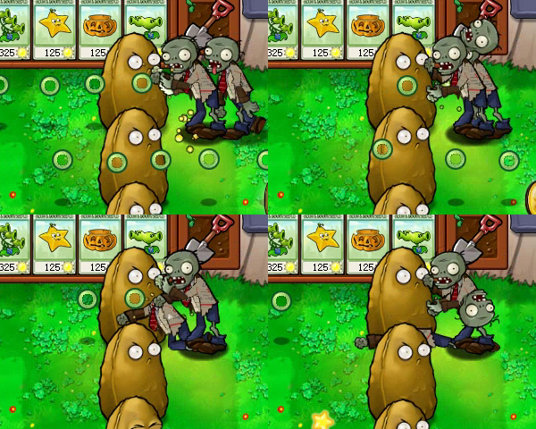
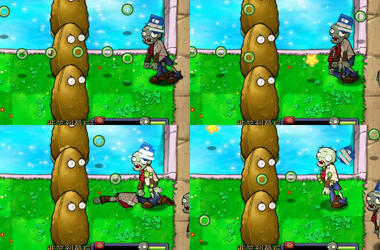

# v0.5 Z01 动作与 Z03 书套脱落实机观察

测试日期：2026-08-31

状态：Z01 啃食和头部脱落阶段通过；手臂掉落动作已经出现，但两只实例重叠，断臂替代袖片仍需单体复核。Z03 的完整、轻伤、重伤和脱落四阶段已在十六项累计包中再次通过。

## 测试对象

| 对象 | SHA-256 / 结果 |
| --- | --- |
| 原版 `PlantsVsZombies.exe` | `6F1729369AC9C5F859E8F3B55FE7D513FBC20B5C54127FD3A1C7E500237FDE6F` |
| 原版 `main.pak` | `3B5291C6600076AAF1791AE1FB2DBF247290A23E903D1D376413DA17358E049D` |
| 十六替换累计 PAK | `9DB70BB44031EF6B12ED92FF9F79BC9737B382D2F0D0383607DA1AAABAADB90B` |
| 累计清单 | `patches/manifests/v0.5-p01-green-circle-p02-p04-z01-sleeves-z03-ingame.json`，2413 个资源中替换 16 项 |
| 场景 | 迷你游戏“谁笑到最后”，白天泳池 |

本轮继续使用原版 EXE，只在测试时换入十六替换累计 PAK。草地行以双发升级、后排辅助火力和高坚果拖住敌人，泳池行使用荷叶、三线射手和高坚果。第一波结束后阵型仍在，第二波最终失败；本记录只验动作和层级，不把它写成关卡通关。

## Z01 动作

| 检查项 | 结果 |
| --- | --- |
| 啃食 | 84.0 秒时两只 Z01 同时啃食高坚果，卷面躯干、内侧袖片和外侧袖片跟随手臂摆动，没有脱离肩部 |
| 头部脱落 | 85.9 秒和 89 秒附近都出现独立头部；无头躯干进入原死亡轨道，卷面没有变回棕色原衣料 |
| 手臂掉落 | 88.6 秒附近能看到一只独立手臂向左掉落，动作本身已经触发 |
| 替代袖片 | 画面中有两只 Z01 重叠，无法把白色骨口和 `Zombie_outerarm_upper2.png` 明确归到同一个实例，因此不记为完整通过 |
| 画面完整性 | 啃食、受击和头部脱落期间没有黑块、方形透明底或固定在屏幕上的部件 |

四格按左上、右上、左下、右下排列，时间分别是 84.0、85.9、88.6 和 89.3 秒。左上是啃食，右上与右下能看到脱落头部，左下能看到横向掉落的手臂。由于实例重叠，这张图只证明掉落动作播放，不单独证明替代袖片的骨口层级。

## Z03 四阶段与共享层级

| 时间 | 阶段 | 结果 |
| ---: | --- | --- |
| 80.0 秒 | 完整 | 深蓝封面、白色题签和卷面本体同时显示 |
| 81.0 秒 | 轻伤 | 书套边缘露出浅色书页，位置没有跳变 |
| 82.0 秒 | 重伤 | 蓝色封面只剩小块，白页占比继续增加 |
| 83.2 秒 | 脱落 | 书套向右飞出，下面的卷面躯干与袖片继续显示，没有残留头盔像素 |

这组画面补上了十六项包中的完整、轻伤、重伤和脱落过程。它与早期十一项包的结果一致，还确认书套离开后能露出当前 Z01 的卷面躯干与袖片。

## 证据哈希

| 文件 | SHA-256 | 保存位置 |
| --- | --- | --- |
| `z01-action-stages-v01.png` | `652CF2EB3BED6D4ED77456F98F50517319F47B27D18C1533A33B93F2DA2EE362` | Git |
| `z03-book-detachment-16pack-v01.png` | `F369C1C4AC27F4CBB5674CD961F1B4CC496ED1B6A05ABCDD459240F5186FD284` | Git |
| `z01-z03-actions-strong-90s.mp4` | `AF061F1D41A838B7D4D4BA9A77ADC09D69E1D4B4D00A086AD9D50257F05EA205` | 本地 `.work`，Git 忽略 |

原始录像为 800×600、90 秒、2699 帧。仓库只保存两张复核图，不提交录像和逐帧调试图。

## 自动核验

- Python 全量测试通过，共 77 项。
- 16 份契约注册表通过，覆盖 5 个槽位和 16 个唯一 PAK 目标。
- 十六替换累计清单预演通过，输出哈希与测试包一致。
- PAK 零替换往返、LawnStrings 检查与同步检查、v0.3 常量补丁预演通过。

## 运行状态恢复

测试前快照位于 `.work/runtime-save-backup-z01-z03-actions-20260831-01`。结束后恢复原版 PAK、八个用户数据文件和窗口设置，并逐项重算哈希。

| 恢复项 | 恢复后 SHA-256 / 数值 |
| --- | --- |
| `main.pak` | `3B5291C6600076AAF1791AE1FB2DBF247290A23E903D1D376413DA17358E049D` |
| `game1_0.dat` | `2AAE128C5A2E588B200BBEDF0EBBA628495B75F9A96EEDD3B9ED2679257A2416` |
| `game1_1.dat` | `FC3DB6123575FF0B75A1F55D54ED658814EAEED611AD8E2AB5A309B4CB1E486F` |
| `game1_62.dat` | `95E0E1E29B1E2DE8E43FCC796B2EE7223E42D80500FC1C88ACE4E286F8BA2DF9` |
| `game1_63.dat` | `2C4C7BAF70E3AAD152DD89DB099FA8DF497C6405B408FDF2F07CB3C942630E82` |
| `log.txt` | `E94BB5CBD29F9E1F358E4569081BF72D638E0E6ADB32CA3E7BA3456ED772F515` |
| `stat1.txt` | `77B16A31EA014056B47193D4939458BF93120737F26B3098584C9810A2143169` |
| `user1.dat` | `7D8CA79F0EFA2B168A8DCEEF89E0FB3C61A64C6B062AEB5F43CB2611B55091F6` |
| `users.dat` | `7812F2BAF43689ED0DC9D077ECEAFA220EF3AF54EF33CE9CAEA1DD3C75BD9651` |
| 窗口设置 | `ScreenMode=0`，`PreferredX=1746`，`PreferredY=451` |
| 游戏进程 | 0 个 |

八个用户数据文件都与测试前快照逐字节一致。根目录保留原版 PAK，游戏进程已经停止。

## 尚未覆盖

- 用单只 Z01 复核 `Zombie_outerarm_upper2.png` 的纸色袖面、白色骨口和掉落手臂是否连续。
- 录到不被其他实例遮挡的无头躯干倒地和消失收尾。
- 水池游泳、夜间、雾夜和屋顶中的 Z01 动作与 Z03 书套对比度。
- 旗帜、铁桶等其他共享基础骨架槽位的同类动作。
- 书套和本体的精确耐久阈值，以及完整迷你游戏流程。
