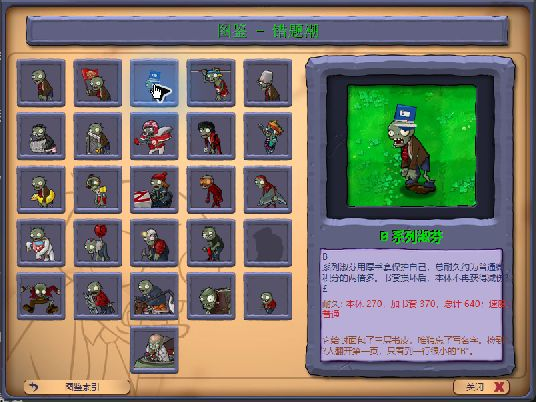
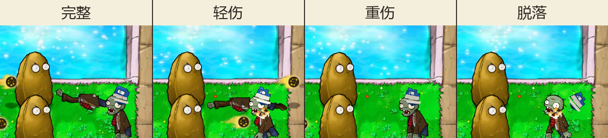

# v0.5 Z03 书套实机观察

测试日期：2026-08-30

状态：图鉴、行走、啃食、完整—轻伤—重伤—脱落的泳池垂直切片通过；跨场景与完整关卡待测。

## 测试对象

| 对象 | SHA-256 / 结果 |
| --- | --- |
| 原版 `PlantsVsZombies.exe` | `6F1729369AC9C5F859E8F3B55FE7D513FBC20B5C54127FD3A1C7E500237FDE6F` |
| 原版 `main.pak` | `3B5291C6600076AAF1791AE1FB2DBF247290A23E903D1D376413DA17358E049D` |
| 十一替换累计 PAK | `B575640C88DFE52EC9919B4B55803D7C6EA717086C14E98A922C500A67ED613A` |
| 累计清单 | `patches/manifests/v0.5-p01-p02-p04-z03-ingame.json`，2413 个资源中替换 11 项 |
| 场景 | 僵尸图鉴；小游戏“谁笑到最后”的白天泳池战场 |

这次累计包只加入 Z03 的三张书套，没有加入 Z01 共享躯干候选，也没有修改 `Zombie.reanim.compiled`、粒子或音效。

## 观察结果

| 项目 | 结果 |
| --- | --- |
| 图鉴放大 | 深蓝厚书、浅色书页和白色“B”题签都能辨认；书套落在头顶，没有黑底或明显漂浮 |
| 行走 | 完整书套随头部动作移动，没有固定在屏幕上的错位，也没有穿过脸部 |
| 啃食 | 前倾啃食时仍贴合头部，书脊方向和接触位置保持稳定 |
| 完整阶段 | 45.0 秒画面中封面完整，蓝色主体与白色题签清楚 |
| 轻伤阶段 | 45.8 秒画面中封面边角撕开，露页量增加，位置没有跳变 |
| 重伤阶段 | 46.4 秒画面中蓝色封面只剩较小残片，白页进一步露出 |
| 书套脱落 | 47.4 秒画面中书套已经离开头部并向右飞出；随后基础僵尸继续移动，没有残留书套像素 |
| 透明与锚点 | 四个状态之间没有出现黑块、整图闪到错误位置或锚点跳动 |

四阶段切片来自同一段 80 秒的游戏窗口录像，依次取 45.0、45.8、46.4 和 47.4 秒。原始录像与未裁切帧只留在本地、由 Git 忽略；仓库保存上面两张复核图。

| 证据图 | SHA-256 |
| --- | --- |
| `z03-almanac-v01.png` | `B0516F4D71F149DFE764EECBF1344D6B0CAF66CD1D7E43C7AFF77E78C356511C` |
| `z03-damage-stages-v01.png` | `5112AD64B1562FE37F7D59900C403C5B1625217E71C1D155A2C59F84718AE011` |

书套脱落后露出的是原版基础僵尸。这个结果说明装备层能正常清除，不能据此把 Z01“普通微积分”的美术算作完成；它的共享躯干候选还没有装入测试包。

## 自动检查

- Python 全量测试通过，共 68 项。
- 累计清单预演通过，确认 2413 个资源中只替换 11 项。
- 累计输出哈希与清单记录一致：`B575640C88DFE52EC9919B4B55803D7C6EA717086C14E98A922C500A67ED613A`。

## 运行状态恢复

测试前备份了 PAK、五个存档文件和注册表；观察结束后逐项写回并重新核对。

| 恢复项 | 恢复后 SHA-256 / 数值 |
| --- | --- |
| `PlantsVsZombies.exe` | `6F1729369AC9C5F859E8F3B55FE7D513FBC20B5C54127FD3A1C7E500237FDE6F` |
| `main.pak` | `3B5291C6600076AAF1791AE1FB2DBF247290A23E903D1D376413DA17358E049D` |
| `game1_0.dat` | `2AAE128C5A2E588B200BBEDF0EBBA628495B75F9A96EEDD3B9ED2679257A2416` |
| `log.txt` | `E94BB5CBD29F9E1F358E4569081BF72D638E0E6ADB32CA3E7BA3456ED772F515` |
| `stat1.txt` | `77B16A31EA014056B47193D4939458BF93120737F26B3098584C9810A2143169` |
| `user1.dat` | `7D8CA79F0EFA2B168A8DCEEF89E0FB3C61A64C6B062AEB5F43CB2611B55091F6` |
| `users.dat` | `7812F2BAF43689ED0DC9D077ECEAFA220EF3AF54EF33CE9CAEA1DD3C75BD9651` |
| 窗口设置 | `ScreenMode=0`，`PreferredX=1746`，`PreferredY=451` |
| 游戏进程 | 0 个 |

## 尚未覆盖

- 夜间、雾夜、屋顶和普通水池冒险关中的对比度与遮挡。
- 从布阵到胜利或失败的完整关卡流程。
- 三档切换的精确耐久阈值；本轮只确认顺序和画面，不把录像帧当作数值测量。
- Z01 共享躯干候选装入后，装备存在、受损、脱落和死亡动作的跨槽位回归。
